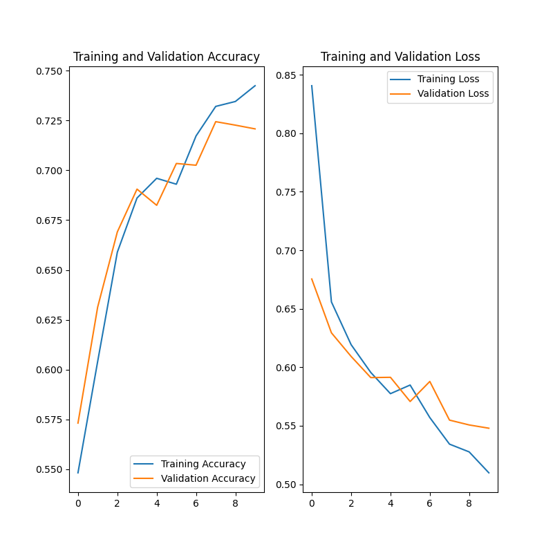

# Logistic Regression

The dataset used to test this code can be found at:

    https://www.kaggle.com/datasets/tongpython/cat-and-dog

The code presents a deep learning model created starting and improving from the following Tensorflow tutorial:

    https://www.tensorflow.org/tutorials/images/classification

The result of the model after training with 10 epochs is:

The final result of the model after 10 epochs running `learn_classification_model.py` is stored in:

    ./sequential_resulting_model/

To classify an image, consider running `classify.py <path_to_img>`, which will yield something like the following:

    $ ./classify.py test_set/dogs/dog.4369.jpg
    ...
    Loaded saved model with the following summary:
    Model: "sequential_1"
    _________________________________________________________________
     Layer (type)                Output Shape              Param #   
    =================================================================
     sequential (Sequential)     (None, 256, 256, 3)       0         
                                                                     
     rescaling (Rescaling)       (None, 256, 256, 3)       0         
                                                                     
     conv2d (Conv2D)             (None, 256, 256, 16)      448       
                                                                     
     max_pooling2d (MaxPooling2D  (None, 128, 128, 16)     0         
     )                                                               
                                                                     
     conv2d_1 (Conv2D)           (None, 128, 128, 32)      4640      
                                                                     
     max_pooling2d_1 (MaxPooling  (None, 64, 64, 32)       0         
     2D)                                                             
                                                                     
     conv2d_2 (Conv2D)           (None, 64, 64, 64)        18496     
                                                                     
     max_pooling2d_2 (MaxPooling  (None, 32, 32, 64)       0         
     2D)                                                             
                                                                     
     dropout (Dropout)           (None, 32, 32, 64)        0         
                                                                     
     flatten (Flatten)           (None, 65536)             0         
                                                                     
     dense (Dense)               (None, 128)               8388736   
                                                                     
     dense_1 (Dense)             (None, 2)                 258       
                                                                     
    =================================================================
    Total params: 8,412,578
    Trainable params: 8,412,578
    Non-trainable params: 0
    _________________________________________________________________
    None
    1/1 [==============================] - 0s 139ms/step
    The probability of the input image containing a label is:
        - label 0: 0.08685231953859329
        - label 1: 0.8988664150238037

